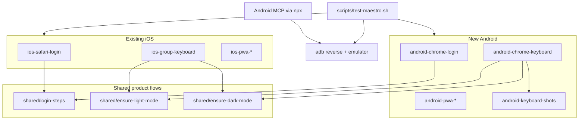

# Android / PWA Maestro + MCP parity

## Goal

Match the iOS loop agents already use: **Maestro YAML + yarn scripts + LAN/dev server + MCP for exploratory tap/screenshot**. Reuse product steps (OTP, theme toggle, keyboard shot structure); keep browser chrome and keyboard IME asserts platform-specific.

## Architecture

## Key technical constraints (decisions)

1. **Emulator URL:** Prefer `adb reverse tcp:$PORT tcp:$PORT` and `APP_URL=http://localhost:$PORT` so Chrome treats the origin as a secure context (needed for install prompts). Fall back to `http://10.0.2.2:$PORT` only for non-PWA Chrome flows if reverse fails. Do **not** rely on LAN IP inside the emulator the way iOS Simulator does.
2. **PWA installability:** SW registers only in prod ([`src/main.tsx`](src/main.tsx)); [`public/sw.js`](public/sw.js) has no `fetch` handler. Android PWA flows will target **`yarn build && yarn preview`** (prod assets) on a reversed localhost port. Install path: in-app **Install app** when `beforeinstallprompt` fires ([`InstallPrompt.tsx`](src/components/InstallPrompt.tsx)); else Chrome overflow **Install app** / **Add to Home screen**. First implementation pass validates which path works on a Play-Store AVD and locks the YAML to that.
3. **Keyboard asserts:** iOS uses visible `"return"` / tap `"Done"`. Android gets its own [`maestro/android-keyboard-shots.yaml`](maestro/android-keyboard-shots.yaml) (IME label + `pressKey: back` or hide-keyboard), same `SHOT_PREFIX` + closed/open/closed-after pattern, prefixes `maestro-android-keyboard*` / `maestro-android-pwa-keyboard*`.
4. **`clearState`:** Allowed on `com.android.chrome` (unlike Safari). Use it at the start of Android login/PWA flows for clean sessions.
5. **MCP:** Wire `@moallemi/android-mcp-server` via `npx` in Cursor MCP config (same pattern as `ios-simulator-mcp`). Requires `adb` + a booted emulator. Document in requirements; agent configures MCP when possible.

## Implementation

### 1. Extract shared product flows

Create [`maestro/shared/`](maestro/shared/) with `appId: ${APP_ID}`:

- `login-steps.yaml` — from [`maestro/ios-safari-login-steps.yaml`](maestro/ios-safari-login-steps.yaml)
- `ensure-light-mode.yaml` / `ensure-dark-mode.yaml` — from existing iOS ensure flows
- Optional: `ensure-signed-in.yaml` if nesting stays clean

Point **existing iOS entry flows** at shared files and pass `-e APP_ID=com.apple.mobilesafari` from the runner (or hardcode env in iOS wrappers). Keep iOS entry filenames (`ios-*.yaml`) so current yarn scripts stay stable. Leave iOS-only chrome (share sheet, `"return"` keyboard) in `ios-*` files.

### 2. New Android Maestro flows

| Flow                                      | Yarn script                         | Purpose                                          |
| ----------------------------------------- | ----------------------------------- | ------------------------------------------------ |
| `maestro/android-chrome-login.yaml`       | `test:maestro:android`              | Launch Chrome → `openLink` → OTP → Your groups   |
| `maestro/android-chrome-keyboard.yaml`    | `test:maestro:android:keyboard`     | Create group → light/dark keyboard shots         |
| `maestro/android-pwa-install-login.yaml`  | `test:maestro:android:pwa`          | Install → open standalone Hork → login if needed |
| `maestro/android-pwa-group-keyboard.yaml` | `test:maestro:android:pwa:keyboard` | Prefer installed PWA; keyboard light+dark        |

All use `appId: com.android.chrome` (or `${APP_ID}`), `androidWebViewHierarchy: devtools` if web taps flake, and shared login/theme steps.

### 3. Extend [`scripts/test-maestro.sh`](scripts/test-maestro.sh)

- Detect Android target from flow path (`android-` prefix) or `MAESTRO_PLATFORM=android`.
- Android URL resolution order:
  1. Explicit `APP_URL`
  2. Ensure `adb` device/`emulator-` online; `adb reverse` for preferred ports (`MAESTRO_PORT`, then 5174/5173/4173); probe `http://127.0.0.1:$port`; emit `http://localhost:$port`
  3. Else probe `http://10.0.2.2:$port` from host… (host cannot hit 10.0.2.2 — instead probe host ports and emit `http://10.0.2.2:$port` for the emulator)
- Always pass `-e APP_ID=…` (`com.apple.mobilesafari` vs `com.android.chrome`).
- Optional helper: `scripts/android-emulator-ready.sh` — check `adb`, list AVDs, print boot/`adb reverse` hints (used by requirements + docs).

### 4. package.json + requirements

Add the four `test:maestro:android*` scripts. Update:

- [`scripts/check-requirements.sh`](scripts/check-requirements.sh) — warn if no `adb` / no emulator; clarify Maestro covers iOS **and** Android
- [`docs/system-requirements.md`](docs/system-requirements.md) — Android Studio / SDK platform-tools, Play Store AVD (Chrome), MCP server
- [`AGENTS.md`](AGENTS.md) — command table + Android notes (`adb reverse`, preview for PWA, test OTP unchanged)
- New [`.cursor/rules/maestro-android.mdc`](.cursor/rules/maestro-android.mdc) — footguns (reverse vs 10.0.2.2, clearState OK, keyboard IME, install path, screenshot copy from `~/.maestro/tests/…`)
- Slim update to [`.cursor/rules/maestro-ios.mdc`](.cursor/rules/maestro-ios.mdc) — point at shared flows / Android sibling
- [`.cursor/rules/system-requirements.mdc`](.cursor/rules/system-requirements.mdc) — Android MCP / adb rows if missing

### 5. Android MCP (agent exploration)

- Document + apply Cursor MCP entry for `@moallemi/android-mcp-server` (npx), `ANDROID_HOME` if needed.
- Capabilities parallel to iOS: screenshot, UI tree, tap, type, key events — use for debugging install choreography before freezing Maestro YAML.
- Not part of `yarn verify` (same as iOS Maestro).

### 6. Validate on device (implementation phase)

1. Boot Play Store AVD; confirm Chrome package `com.android.chrome`.
2. Vite LAN + `adb reverse` → `yarn test:maestro:android`.
3. Keyboard shots → copy newest Maestro artifacts into repo `artifacts/` for visual check.
4. `yarn build && yarn preview --host 127.0.0.1 --port 4173` + reverse → PWA install flow; adjust YAML to the install UI that actually appears.
5. `yarn check:requirements` reflects new optional tools.

## Out of scope

- Adding Android Maestro to `yarn verify` / CI (iOS Maestro is also local/optional only).
- Changing product SW/installability (unless PWA install is impossible without a minimal `fetch` handler — then a tiny SW fix becomes in-scope as a one-line enablement).
- Physical-device-only paths (emulator-first; physical device can reuse LAN `APP_URL` manually).

## Prerequisites (user machine — optional like iOS Maestro)

- Android Studio / SDK; `adb` on PATH
- AVD with **Google Play** (Chrome preinstalled)
- Existing Maestro + JDK 17
- Cursor MCP entry for Android server (agent adds when config is writable)
