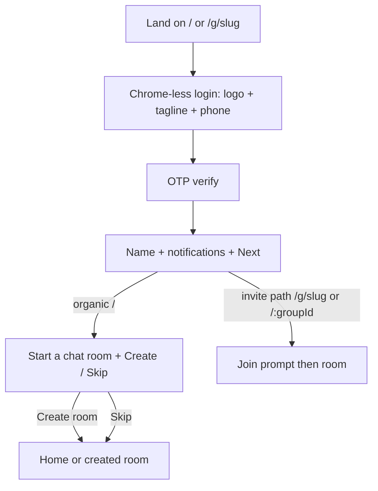

# First Time User Experience

Branch `task/ftue` has creator/member only (no mod role). Tip copy mentioning mods is **aspirational product copy** — show it to creators only; do not implement promote-to-mod in this work.

## Flow

## 1. Chrome-less auth shell

Today [`AppShell.tsx`](src/components/AppShell.tsx) always shows mobile header / desktop sidebar (small logo) even when logged out.

- When `!user`, hide `MobileHeader` and `Sidebar`; render main full-bleed for FTUE.
- Keep normal chrome once authenticated.
- Header **Log in** modal path stays for any future `header` placement; primary path is inline FTUE.

## 2. Default sign-in screen

Rewrite [`SignInScreen.tsx`](src/components/auth/SignInScreen.tsx) (+ phone step in [`SignInForm.tsx`](src/components/auth/SignInForm.tsx)):

- Large `/yowl-logo.svg` as hero (accessible name **Yowl**, not all-caps “YOWL”)
- Tagline: _Start a chat room and share it with anyone, right now. Perfect for work trips and meetups._
- _All you need is a phone number:_ then existing masked phone field + send CTA
- Invite path (`RequireAuth heading` on `/g/:slug`): same chrome-less layout + large logo; keep invite-aware heading (_Sign in to join this room_) instead of the organic tagline when on an invite URL

OTP step stays utilitarian (code entry) under the same shell.

## 3. Onboarding: name + notifications

Update [`DisplayNameForm.tsx`](src/components/DisplayNameForm.tsx) for the onboarding variant:

- Heading/label: **What's your name?**
- Placeholder (keep a short example, e.g. `Fox`)
- Existing [`NotificationsSwitch`](src/components/NotificationsSwitch.tsx)
- Primary CTA: **Next** (drop onboarding **Skip for now** so FTUE leads people in; Account → Change name keeps inset Save)

**Fix gate (required):** [`hasChosenDisplayName`](src/lib/supabase/auth.ts) today is `Boolean(user_metadata.display_name)`, but create-user seeds `···1234` via `displayNameFromPhone`, so the name step never shows. Treat phone-fallback patterns (`/^···\d{4}$/`) as not chosen. Add a small unit test.

## 4. Post-onboarding create-room step (organic only)

Add a `create-room` step after name in `SignInForm` (or a sibling component mounted from it):

- Title: **Start a chat room**
- Room name input (reuse create logic from [`NewGroupModal.tsx`](src/components/NewGroupModal.tsx) / `addGroup`)
- Warning: _Remember: Anyone with the link to your chat room will be able to join it._
- **Create room** → create + navigate to `/:groupId`
- **Skip** → `onSuccess` → home empty state

**Skip this entire step** when the user signed in from an invitation path: `useMatch('/g/:slug')` or `useMatch('/:groupId')` (invite → join → room unchanged).

## 5. Room feed creator tip well

In [`GroupPage.tsx`](src/pages/GroupPage.tsx) message list (`!items.length` and/or above first message):

- For **creator** only (`groups.creator_id` / membership `role === 'creator'`): replace/augment the generic _Say hi…_ empty with a sunken well containing:
  - **Invite someone** button → existing `ShareGroupModal`
  - Copy: _Once people join you can promote them to mods_
- Non-creators keep the current empty state
- When messages exist: show the same well **above the first message** for creators (dismissible not required unless it feels sticky; default: show while creator and feed is empty or as a top-of-feed tip until at least one other member has joined — prefer **empty feed only** if dual placement feels noisy; implement empty-first, then top-of-feed if empty path alone misses “above first message”)

Concrete choice: **always render the well as the first feed item for creators** (empty or with messages), so it sits above the first message when any exist. Hide once the room has ≥1 other member (tip fulfilled).

## 6. Tests + docs

- Update Maestro [`maestro/shared/login-steps.yaml`](maestro/shared/login-steps.yaml) and any e2e asserting header `Yowl` on unauth home ([`a11y-home.spec.ts`](tests/e2e/a11y-home.spec.ts) — assert large logo / `sign-in-screen` instead of header brand when logged out)
- Extend [`auth-flow.spec.ts`](tests/e2e/auth-flow.spec.ts) or add FTUE coverage for chrome-less sign-in; note OTP still seeded in Playwright
- Unit test `hasChosenDisplayName`
- Light updates: [`docs/ux.md`](docs/ux.md) Identity / shell, [`docs/features.md`](docs/features.md) auth onboarding

## Out of scope

- Implementing `mod` role / promote UI (roadmap deferred; tip is forward-looking)
- Changing Twilio OTP or join-consent rules
- Redesigning authenticated home empty state beyond Skip landing there
