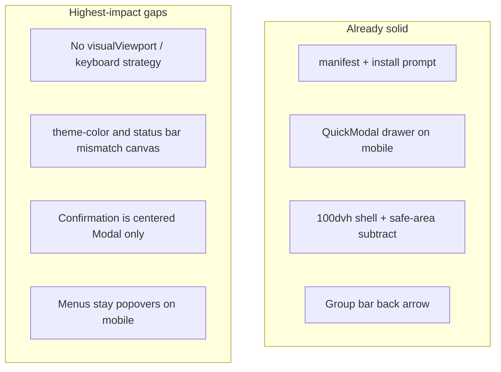

# Mobile / PWA compatibility assessment

## Verdict

Hork is **installable and partially edge-aware**, with a good mobile overlay pattern for content sheets (`QuickModal`). It is **not yet keyboard-safe** on iOS, and **system chrome does not blend** with the app canvas. Action menus and confirmations still feel web-native on phones.

---

## Current state (by concern)

### PWA install and chrome — mostly good

| Piece                                                        | Status                                                                                                      |
| ------------------------------------------------------------ | ----------------------------------------------------------------------------------------------------------- |
| [`public/manifest.webmanifest`](public/manifest.webmanifest) | Present: `standalone`, icons (any + maskable), light `theme_color`                                          |
| [`index.html`](index.html)                                   | `viewport-fit=cover`, light/dark `theme-color`, apple capable + title                                       |
| Install UX                                                   | [`InstallPrompt`](src/components/InstallPrompt.tsx) + [`useInstallPrompt`](src/lib/pwa/useInstallPrompt.ts) |
| SW                                                           | Push-only [`public/sw.js`](public/sw.js) — offline caching out of scope for this pass                       |

### Virtual keyboard / viewport — weak

- Shell uses `100dvh` minus safe-area in [`AppShell.tsx`](src/components/AppShell.tsx); composer is **flex-pinned**, not `position: fixed` ([`GroupPage.tsx`](src/pages/GroupPage.tsx)).
- **No** `visualViewport` listeners, **no** `interactive-widget` viewport meta, **no** scroll-focused-input handling.
- On iOS (Safari and often standalone PWA), the keyboard commonly **covers the composer** because `dvh` does not reliably shrink with the keyboard. Android Chrome more often resizes layout.

### Edge blending (status / home indicator) — mismatched

Today:

- Body pads with `env(safe-area-inset-*)` while the shell also subtracts those insets from height — letterboxed content area.
- `theme-color` is **brand purple** (`#7443CC`) / dark gray-900 (`#221D33`), not `surface.canvas` (`gray.50` / `gray.900`).
- Manifest `background_color` is `#ffffff` (splash/letterbox may flash white).
- `apple-mobile-web-app-status-bar-style` is **`default`** (opaque), not `black-translucent` — fights true edge-to-edge painting.

Result: system bars and safe-area gutters do not read as continuous app chrome.

### Dialogs / close-back — mostly good for sheets; confirmation lags

- [`QuickModal`](src/ui/QuickModal.tsx): modal ≥`md`, bottom drawer on mobile; **always** renders `DrawerCloseButton` / `ModalCloseButton`; overlay + Esc work via Chakra defaults. Used for sign-in, new group, rename, members, share, change name.
- Group route mobile has an explicit **back** control on `GroupBar`.
- Gaps: no swipe-to-dismiss; [`confirmation.tsx`](src/dialogs/confirmation.tsx) is a **centered Modal on all breakpoints** with **Cancel only** (no X), so leave/delete/remove feel desktop-modal especially when stacked over a Members drawer.

### Menus — popovers everywhere

- [`UserMenu`](src/components/UserMenu.tsx) and `GroupOverflowMenu` in [`GroupPage.tsx`](src/pages/GroupPage.tsx) use Chakra `Menu` on **all** breakpoints.
- On mobile, the avatar menu also carries the **group list** (sidebar substitute) — a floating popover is a poor fit for a long navigational list.
- Short action lists (⋯ overflow) would feel more native as bottom action sheets.

---

## Remediation approach (chosen)

**Docs/rules first as the contract**, then **critical code** that makes the contract true. Defer swipe-to-dismiss, offline SW, and manifest screenshots/shortcuts.

### 1. Codify native-app standards in docs/rules

Update [`.cursor/rules/ux-standards.mdc`](.cursor/rules/ux-standards.mdc) and [`docs/ux.md`](docs/ux.md) with a **Native / PWA** section:

- **Viewport:** app frame tracks the **visible** viewport (prefer `visualViewport` height when keyboard is open); never rely on `100vh` alone; composer must remain above the keyboard.
- **Safe areas + chrome blending:** paint `html`/`body` with `surface.canvas`; extend UI into safe areas with padding on chrome (headers, composer, drawers), not opaque letterboxing; `theme-color` / manifest `background_color` / `theme_color` track canvas (light + dark); prefer `black-translucent` when edge-to-edge.
- **Overlays:** every overlay has an obvious dismiss (X and/or Cancel); content sheets use `QuickModal`; **confirmations use the same mobile drawer shell**; Esc/overlay dismiss remain available unless a destructive confirm intentionally requires an explicit choice (keep Cancel).
- **Menus:** on mobile, short action lists → bottom **action sheet** (drawer); longer navigational lists (groups) → bottom or full **drawer**, not `Menu` popovers. Desktop may keep `Menu`.
- **One top bar** on mobile group routes (already documented) — keep as hard rule.

### 2. Critical code — edge blending

- Set body/`#root` background to canvas tokens (via theme global styles in [`ThemeProvider.tsx`](src/theming/ThemeProvider.tsx) and/or `index.html` light/dark CSS).
- Prefer **content extends under safe areas** with padding on chrome bars / composer / fixed banners, instead of body padding + shell double-subtraction (verify on notched iPhone standalone).
- Align `theme-color` meta + manifest `theme_color` / `background_color` with canvas (and dark equivalents).
- Switch `apple-mobile-web-app-status-bar-style` to `black-translucent` once canvas paints under the status bar.
- Optionally sync `theme-color` at runtime when the user toggles color mode (meta currently follows `prefers-color-scheme` only, not in-app toggle).

### 3. Critical code — virtual keyboard

- Add a small hook (e.g. `useVisualViewportHeight`) that sets a CSS variable `--app-height` from `visualViewport.height` (with `100dvh` fallback).
- Drive [`AppLayout`](src/components/AppShell.tsx) height from that variable.
- On composer focus, ensure the scroll area keeps the focused field in view (`visualViewport` resize + scrollIntoView on the TipTap host).
- Add viewport meta `interactive-widget=resizes-content` where supported (Chrome) as a progressive enhancement.

### 4. Critical code — overlays and menus on mobile

- Route [`ConfirmationProvider`](src/dialogs/confirmation.tsx) through `QuickModal` (or equivalent drawer-on-mobile) so Cancel + close X exist on phones; keep destructive confirm styling.
- Introduce a thin **`ActionSheet`** (or reuse `QuickModal` bottom drawer with a menu-like list) for:
  - Group overflow (⋯)
  - UserMenu when `showGroups` / dense mobile chrome (especially group nav list)
- Keep desktop `Menu` behavior.

### 5. Verification

- Manual: iOS Safari + Add to Home Screen — keyboard open on chat, status/home indicator blending, drawer dismiss, overflow as sheet.
- Android Chrome — install, keyboard resize, theme-color.
- `yarn verify` after code changes.
- No new e2e dependency on real devices in CI; unit-test the viewport hook if non-trivial.

---

## Out of scope (this pass)

- Full offline PWA / `vite-plugin-pwa`
- Swipe-to-dismiss gesture on drawers
- Manifest `screenshots` / `shortcuts` / `id`
- Web Push VAPID completion (already roadmap Tier 2)

---

## Key files

| Area         | Files                                                                                                                                                                                                                    |
| ------------ | ------------------------------------------------------------------------------------------------------------------------------------------------------------------------------------------------------------------------ |
| Docs         | [`docs/ux.md`](docs/ux.md), [`.cursor/rules/ux-standards.mdc`](.cursor/rules/ux-standards.mdc)                                                                                                                           |
| Edges / meta | [`index.html`](index.html), [`public/manifest.webmanifest`](public/manifest.webmanifest), [`src/theming/ThemeProvider.tsx`](src/theming/ThemeProvider.tsx), [`src/components/AppShell.tsx`](src/components/AppShell.tsx) |
| Keyboard     | new hook under `src/lib/` or `src/hooks/`, [`AppShell.tsx`](src/components/AppShell.tsx), composer / TipTap host                                                                                                         |
| Overlays     | [`src/ui/QuickModal.tsx`](src/ui/QuickModal.tsx), [`src/dialogs/confirmation.tsx`](src/dialogs/confirmation.tsx), [`UserMenu.tsx`](src/components/UserMenu.tsx), [`GroupPage.tsx`](src/pages/GroupPage.tsx)              |
