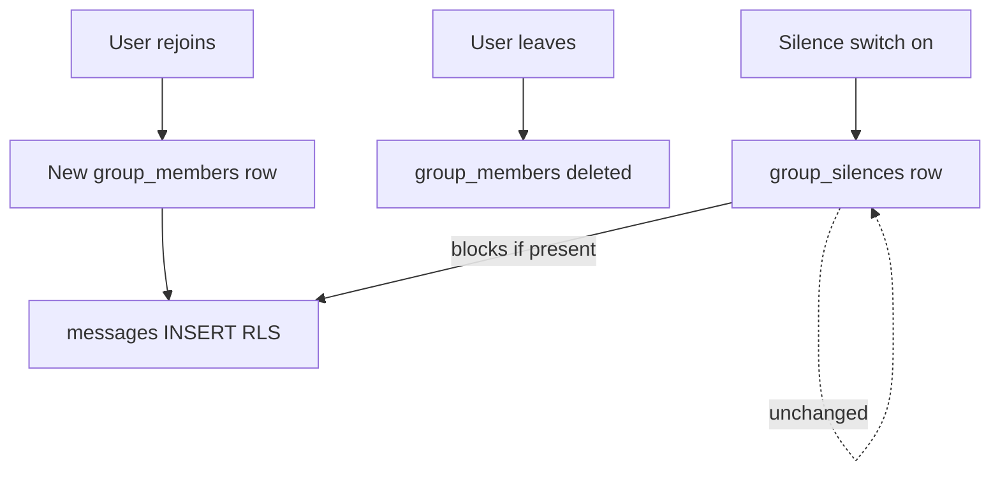

# Add room moderators and silence

## Decisions (locked)

- **No ban/kick** — drop creator-remove-member UI and the `group_members_delete_creator` RLS policy. Membership is only removed by self-leave or room delete.
- **Silence persists across leave/rejoin** — source of truth is a separate [`group_silences`](supabase/migrations/) table keyed by `(group_id, user_id)`, not a column on `group_members` (that row is deleted on leave). Message insert checks this table. Turning Silence off deletes the row.
- **Mod does not persist** — `role` stays on `group_members`; leave → rejoin as plain `member`. Staff must re-mod if desired.
- **Hierarchy** — creator cannot be silenced or demoted; creator + mods are staff; mods can silence/mod other non-creators and **self-unmod**; delete room stays creator-only; rename is staff.
- **Silenced leavers** — staff need a way to unsilence without waiting for rejoin: Members modal includes a **Silenced** subsection (rows from `group_silences` with no current membership) with the same profile popover / Silence switch.
- **Announcements** — out of scope; `is_announcement` already exists; staff gate reused later.

## 1. Database migration

New file under [`supabase/migrations/`](supabase/migrations/) (timestamped):

- Extend enum: `alter type public.group_role add value if not exists 'mod';`
- **Do not** add `is_silenced` on `group_members`.
- Create `public.group_silences`:
  - `group_id uuid` FK → `groups` on delete cascade
  - `user_id uuid` FK → `auth.users` on delete cascade
  - `display_name text` nullable (snapshot at silence time for roster when they are not a member)
  - `photo_url text` nullable
  - `silenced_by uuid` nullable → `auth.users`
  - `created_at timestamptz not null default now()`
  - primary key `(group_id, user_id)`
- Helper: `public.is_group_staff(gid uuid)` — actor is room `creator_id` **or** `group_members.role in ('creator','mod')`.
- Helper: `public.is_silenced_in_group(gid uuid, uid uuid)` — exists row in `group_silences`.
- **RLS**
  - Drop `group_members_delete_creator` (no kick).
  - Replace `groups_update_creator` with staff check (rename).
  - Tighten `messages_insert_member`: must be member **and** `not is_silenced_in_group(group_id, auth.uid())`.
  - `group_silences`: select for authenticated members/staff of that group (or any authenticated if roster is already open — match `group_members` select openness); insert/delete only for staff; with check that target is not `groups.creator_id` and target ≠ actor.
  - `group_members_update_staff` + BEFORE UPDATE trigger for **role only** (member ↔ mod rules; creator row immutable; self-unmod; no self-promote). No silence columns on membership.
- Add `group_silences` to `supabase_realtime` publication so roster/composer update live.
- Regenerate [`src/lib/supabase/types.ts`](src/lib/supabase/types.ts) after apply.

Apply with `supabase db push` (not MCP `apply_migration`) per [`.cursor/rules/supabase.mdc`](.cursor/rules/supabase.mdc).

## 2. API layer

[`src/api/group.ts`](src/api/group.ts) (and small helper module if cleaner):

- Extend `GroupMember.role` to `'creator' | 'mod' | 'member'`.
- `useGroupSilences(groupId)` — list silenced user ids (+ display snapshot); realtime.
- When mapping roster for UI, join/overlay: `isSilenced = silences.has(uid)`.
- `setMemberSilenced(groupId, userId, silenced, profileSnapshot?)` — upsert/delete `group_silences` (not membership update).
- `setMemberMod(groupId, userId, isMod)` — update `group_members.role`.
- `joinGroup` unchanged (plain member insert); posting still blocked if a silence row exists.
- Permission helpers + unit tests; remove ban/`removeGroupMember` moderation path (keep `leaveGroup`).

## 3. UI — profile popover + members list

All in [`src/pages/GroupPage.tsx`](src/pages/GroupPage.tsx):

**`MemberProfileBody`**

- Badges: Room creator / Mod / Silenced.
- **Silence** + **Mod** switches for staff (creator target: neither). Silence reads/writes `group_silences`. Mod only when target is currently a member (cannot mod a non-member silence row).
- No confirm dialogs; toast on failure.

**`MembersList` / Members modal**

- Remove ban `IconButton`.
- Active members: MorphingPopover + `MemberProfileBody` (same as message author).
- Badges including `silenced` when overlay says so.
- **Silenced** subsection (staff always; or everyone if we show badge elsewhere): users in `group_silences` who are **not** in `group_members`, using snapshot name/photo; popover with Silence switch only (turn off to forgive before they return). Empty subsection omitted.

**Room options + chat**

- `isStaff = isCreator || myMember?.role === 'mod'`.
- **Rename room** when `isStaff`.
- Message popovers: Silence/Mod; drop `canBan`.
- **Composer**: if current user id ∈ silences, disable send + “You’re silenced in this room.”

## 4. Docs / roadmap touch

- [`docs/architecture.md`](docs/architecture.md) — `mod` on members; `group_silences` persists mute across leave/rejoin; mod does not.
- [`docs/features.md`](docs/features.md) / [`docs/roadmap.md`](docs/roadmap.md) — roles partially shipped; announcements still deferred.

## 5. Tests + verify

- Unit tests for permission helpers + “silence independent of membership” expectations.
- Grep e2e/Maestro for Ban strings; update if needed.
- `yarn verify`.

## Edge cases covered

| Case                         | Behavior                                                                          |
| ---------------------------- | --------------------------------------------------------------------------------- |
| Creator viewed by staff      | No Silence/Mod switches                                                           |
| Mod silences another mod     | Allowed; silence row written                                                      |
| Silenced user leaves         | Membership gone; silence row remains; cannot post if they rejoin until unsilenced |
| Silenced user rejoins        | Joins as `member`; still cannot post; shows Silenced badge; Mod lost              |
| Staff unsilences leaver      | Via Silenced subsection; deletes silence row                                      |
| Mod self-unmod               | Mod switch off on own profile                                                     |
| Silenced mod (still in room) | Cannot post; can still rename/silence/mod                                         |
| Room delete                  | Cascades silences + members                                                       |
