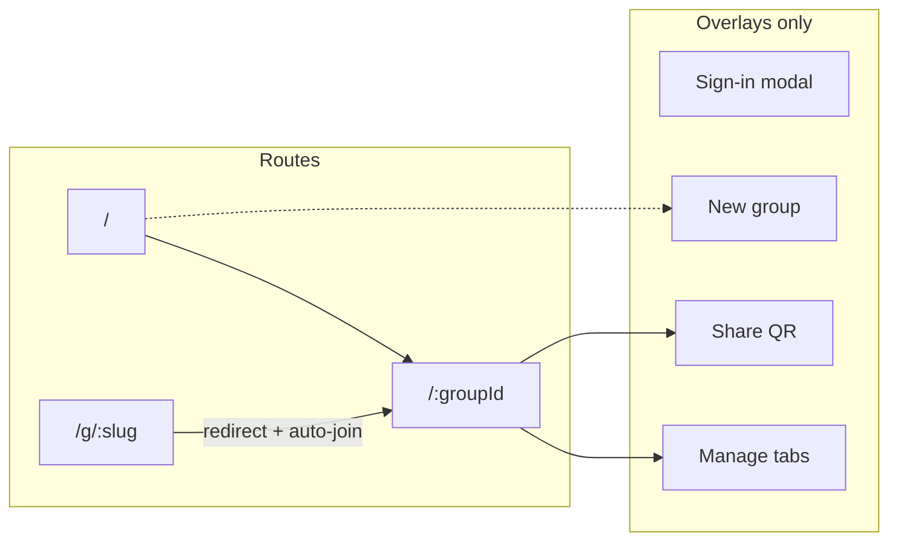
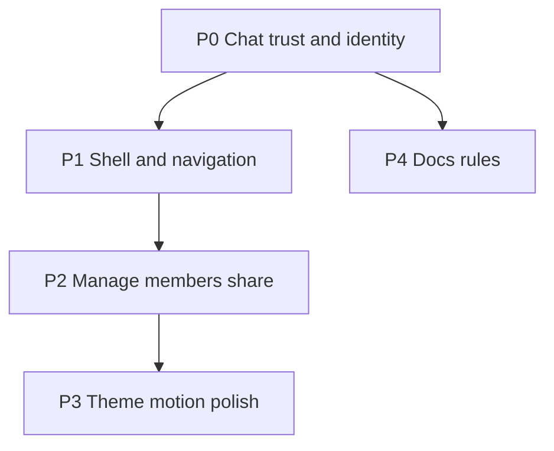

# Hork UX / IA Review & Improvement Roadmap

**Verdict:** The product is structurally close to the right idea (tiny surface area, SMS auth, share-by-link, modal-on-desktop / drawer-on-mobile), but the _chat experience and information scent_ are currently inverted or incomplete relative to Slack. Users will forgive a plain look; they will not forgive composer-on-top, silent blank screens, `···1234` identities, or a home that lists every group in the database. Fix feel-and-flow first; then polish the visual system and lock standards in docs/rules.

**North star:** Device-appropriate Slack-class utility — snappy, stylish, modern — loved because it works and feels great. Brand is secondary.

---

## Current IA (as-is)

Everything secondary is modal/drawer-based ([`QuickModal`](src/ui/QuickModal.tsx)). That pattern is good — keep it. The problems are _what is missing_, _what is inverted_, and _what is silent_.

---

## Priority 0 — Trust & chat mental model (do first)

These make the app feel broken or wrong for anyone who has used Slack/iMessage.

### 1. Invert the chat layout to Slack norms

**Today** ([`GroupPage.tsx`](src/pages/GroupPage.tsx)): composer **above** a newest-first list.  
**Change:** Chronological messages (oldest → newest), composer **pinned to bottom**, auto-scroll to latest on open / own send / new message when near bottom. Full-height column (`100dvh` minus chrome), not a short scroll of cards in a padded box.

### 2. Keyboard-first send

Enter (or Cmd/Ctrl+Enter) sends; Shift+Enter newline. Absolute-positioned Send stays as secondary affordance. Optional: simplify rich-text for MVP — bold/italic only; defer headings/links/`window.prompt` until needed.

### 3. Never blank the UI

Replace pervasive `if (error) return null` / empty `return null` with:

- **Empty home:** illustration + “Create a group” primary CTA (creation is currently buried: avatar → menu → New group).
- **Empty chat:** “Say hi — this is the start of {group}.”
- **Errors:** inline retry + human copy (not null, not Vite-dev copy from [`Router.tsx`](src/routing/Router.tsx)).
- Prefer **skeletons** over swapping the whole header for a spinner (layout jump).

### 4. Membership-scoped group list (product + privacy)

[`useGroups`](src/api/group.ts) selects _all_ groups. Home and the header menu must show **only groups the user belongs to**. Treat this as both UX and security/IA.

### 5. Real identity before chat

Phone-derived `···1234` ([`auth.ts`](src/lib/supabase/auth.ts)) kills social feel. After first OTP success (or from avatar menu): a short **“What should people call you?”** sheet; persist `display_name` in user metadata. Avatar stays generated until photo upload exists.

### 6. Optimistic send

Clear composer immediately; append a pending bubble; reconcile on realtime/refetch. Failed send: restore text + toast. Today’s await-then-full-refetch feels laggy.

---

## Priority 1 — Navigation, chrome, flows

### 7. Device-split shell (Slack-shaped, not mobile-column-everywhere)

| Surface    | Mobile                                    | Desktop (`md+`)                                                        |
| ---------- | ----------------------------------------- | ---------------------------------------------------------------------- |
| Groups     | Home list + avatar menu (or bottom sheet) | Persistent **left sidebar** (~240–280px) with group list + “New group” |
| Chat       | Full-bleed under compact chrome           | Main pane beside sidebar                                               |
| Create     | Prominent on home + sidebar               | Same                                                                   |
| Color mode | Icon-only in overflow/settings            | Icon-only; remove labeled “Dark/Light” button                          |

Introduce a shared **app layout route** (Header/shell + `RequireAuth`) so pages stop re-nesting [`SignInPlacementFromAuth` → `Header` → `RequireAuth`](src/pages/HomePage.tsx) three times.

### 8. Collapse double headers on group pages

App header + [`GroupHeader`](src/pages/GroupPage.tsx) waste vertical space. Prefer one sticky bar: back/home (or sidebar on desktop), group title, Share, overflow (Manage / Leave). On mobile, brand wordmark can shrink or hide while in a group.

### 9. Invite join with consent (not silent auto-join)

Today `ensureGroupMember` runs on every group visit. For `/g/:slug` (and first visit to a non-member group): interstitial **“Join {name}?”** with Join / Cancel → home. After join, land in chat. Auto-join may remain only for creator’s first navigation after create.

### 10. Surface “New group” on home

Primary empty-state and always-visible `+` / button. Keep modal/drawer create form; stop making avatar the only entry.

### 11. Catch-all + not-found

Add `*` 404. Treat missing group / slug as a real page: “Group not found” + link home (not a dead spinner or orphan sentence).

---

## Priority 2 — Dialogs, manage, members

### 12. Share sheet cleanup

Retitle to **“Share {group}”** (not “Join …” with a camera icon). Keep QR + Copy + native Share in `QuickModal`. Success: brief toast (already good).

### 13. Manage modal: ship less

- Remove empty **Permissions** tab until it has UI.
- Rename on explicit Save (or clear Save button), not blur-only with yellow pencil mystery.
- Drop personal “♥ Linc” footer from product chrome (or move to an About item).
- Add **Leave group** for non-creators; **Delete group** for creators — use mounted [`ConfirmationProvider`](src/dialogs/confirmation.tsx) (currently dead / unmounted).

### 14. Members (lightweight)

Drawer/sheet: roster with avatars + display names. Creator can remove; everyone can leave. No roles UI until needed — delete the empty Permissions placeholder rather than teasing it.

### 15. Profile from avatar

Menu: **Edit name**, groups (mobile), theme, Log out. Optional later: photo.

---

## Priority 3 — Visual system, motion, components

### 16. Theme tokens (purple foundation, teal action)

[`ThemeProvider.tsx`](src/theming/ThemeProvider.tsx) is stock Chakra + blue links; product CTAs are green; form kit presets are purple. Consolidate:

- **Purple is the brand and neutral foundation:** use desaturated purple-grays for app chrome, page backgrounds, surfaces, borders, selected navigation, focus-adjacent decoration, and identity moments. Purple should establish character without falsely signaling status.
- **Teal is the action hue:** primary buttons, links, switches, active controls, keyboard focus rings, and actionable icons. Reserve it for things the user can do so interaction remains immediately legible.
- Keep semantic indicators independent: green = success/online, red = error/destructive, amber = warning/pending, blue = informational. Never reuse purple or teal to communicate these states.
- Define semantic tokens rather than component-local colors: `brand`, `action`, `surface.canvas`, `surface.raised`, `surface.sunken`, `border`, `text.muted`, `success`, `warning`, `danger`, and their dark-mode equivalents.
- Typography: one distinctive UI font pair (not Inter/system-default stack) — readable utility, not marketing serif.
- Message bubbles: own vs others (subtle bg difference); tighten spacing; drop heavy `shadow="lg"` cards on home in favor of denser list rows (Slack-like).

Target a **clean, soft, native feel with restrained light skeuomorphism**: low-contrast borders, gentle elevation, slightly inset inputs/composer wells, tactile pressed states, and layered sheets that clearly sit above the app. Use shadows to explain hierarchy, not decorate every card. Avoid gradients, glossy effects, oversized radii, and cream/terracotta clichés. Build light and dark themes as equal semantic-token mappings, defaulting to the system preference.

### 17. Micro-motion (2–3 intentional, not noise)

- Message appear (fade/slide 120–180ms).
- Drawer/modal already via Chakra — keep; don’t strip.
- Sidebar active group indicator / list reorder feel.
- Optional: subtle composer focus ring transition.

No page-wide parallax or decorative motion.

### 18. Component re-theme

- Primary actions = teal solid; secondary actions = purple-neutral outline or soft surface; destructive actions = red; icon buttons use quiet purple-neutral chrome.
- Inputs and composer use a subtly sunken surface with a teal focus ring; buttons gain a small pressed-state inset/translation; sheets and menus use restrained raised elevation.
- Switches, links, selected controls, and progress indicators use teal consistently; selected navigation uses a purple-tinted surface so “current location” and “action” remain distinct.
- Unify `iconAfter` vs Chakra `leftIcon` usage via `@@ui` Button.
- Loading: `DelayedSpinner` (exists, unused) or skeletons for lists; buttons use `isLoading` everywhere (add-group currently disables without spinner).

### 19. Desktop width

480px max forever feels like a phone on a monitor. With sidebar: chat pane can grow (`min` ~480, `max` ~720–840) for readable line length.

---

## Priority 4 — State management patterns

| State                      | Target pattern                             |
| -------------------------- | ------------------------------------------ |
| Route/auth loading         | Skeleton shell matching final layout       |
| List loading               | Row skeletons                              |
| Submit (OTP, create, send) | Button `isLoading` + disable double-submit |
| Send message               | Optimistic + pending style                 |
| Rename / profile           | Explicit save + error toast                |
| Offline / RLS errors       | Banner or inline retry, never `null`       |

Wire [`ConfirmationProvider`](src/dialogs/confirmation.tsx) at app root for destructive flows only — don’t invent confirmations for create/send.

---

## Priority 5 — Docs & rules (standards forward)

Add a short durable rule (e.g. [`.cursor/rules/ux-standards.mdc`](.cursor/rules/ux-standards.mdc)) and a thin section in [`docs/architecture.md`](docs/architecture.md) or new `docs/ux.md`:

- Chat layout contract (composer bottom, chrono order, Enter-to-send).
- Empty/error/loading never blank.
- Membership-scoped lists only.
- Device split: sidebar desktop / list+sheets mobile; `QuickModal` for overlays.
- Identity: display name before or immediately after first session.
- Copy: Hork in user-facing strings; no Quacker; no developer copy in `errorElement`.
- Motion budget; purple-neutral / teal-action token roles; restrained skeuomorphic elevation and pressed-state rules; semantic status colors remain independent.

Amend [`.cursor/rules/quacker-core.mdc`](.cursor/rules/quacker-core.mdc) with a one-line pointer to UX standards.

---

## Suggested implementation phases

| Phase | Scope          | Outcome                                                         |
| ----- | -------------- | --------------------------------------------------------------- |
| **A** | P0 items 1–6   | Chat feels right; home/errors honest; names real; lists private |
| **B** | P1 items 7–11  | Slack-like shell; join consent; 404; create obvious             |
| **C** | P2 items 12–15 | Clean overlays; leave/delete; members                           |
| **D** | P3–P4          | Theme, motion, docs/rules                                       |

Verification each phase: `yarn verify` + smoke the home → create → chat → share → join path on mobile width and desktop width.

---

## Explicit non-goals (for now)

- Full Slack feature parity (threads, channels hierarchy, reactions, search).
- Heavy marketing landing — this is a utility; signed-out = sign-in, not a brand site.
- Photo upload / OAuth (roadmap already defers Google).
- Permissions/roles UI until there’s a real permission model.

---

## Highest-leverage file touchpoints

- [`src/pages/GroupPage.tsx`](src/pages/GroupPage.tsx) — chat layout, share/manage, composer
- [`src/pages/HomePage.tsx`](src/pages/HomePage.tsx) — empty state, create CTA, list density
- [`src/components/Header.tsx`](src/components/Header.tsx) — chrome, menu, create entry
- [`src/api/group.ts`](src/api/group.ts) / [`src/api/message.ts`](src/api/message.ts) — membership filter, optimistic/realtime
- [`src/theming/ThemeProvider.tsx`](src/theming/ThemeProvider.tsx) + [`src/ui/Button.tsx`](src/ui/Button.tsx) — tokens & controls
- [`src/routing/Router.tsx`](src/routing/Router.tsx) — layout route, 404, user-facing errors
- New: app shell layout + UX standards rule/doc
